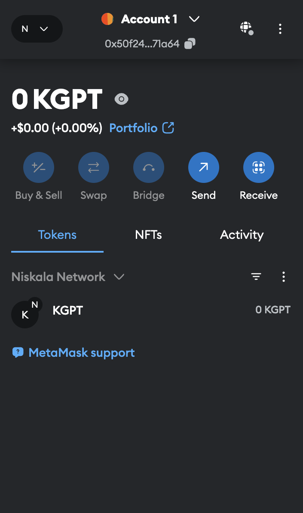

# Configure MetaMask

## Add network to MetaMask

> **Note:** Before following the instructions below, ensure that you have already installed MetaMask on your browser. If not, follow the installation guide [here](https://metamask.io/download/).

This guide provides a step-by-step process to connect MetaMask to the Niskala Network.

1. **Open MetaMask**  
 Click on the MetaMask icon in your browser to open the extension.
<figure></img><figcaption></figcaption></figure>

2. **Add a Custom Network**  
 Click on the network dropdown icon in the top-left corner of MetaMask, then select the `Add a custom network` button.
<figure></img><figcaption></figcaption></figure>

3. **Enter Niskala Network Details**  
   Fill in the following details in the custom network form:

<table>
  <thead>
    <tr>
      <th>Property</th>
      <th>Value</th>
    </tr>
  </thead>
  <tbody>
    <tr>
      <td>Network</td>
      <td>Niskala Network</td>
    </tr>
    <tr>
      <td>HTTPS</td>
      <td>
        <a href="https://mlg1.mandalachain.io/">https://mlg1.mandalachain.io/</a> (testnet)  
        <a href="https://mlg2.mandalachain.io/">https://mlg2.mandalachain.io/</a> (devnet)
      </td>
    </tr>
    <tr>
      <td>Chain ID</td>
      <td>6025</td>
    </tr>
    <tr>
      <td>Symbol</td>
      <td>KPGT</td>
    </tr>
  </tbody>
</table>

<figure></img><figcaption></figcaption></figure>

4. **Switch to Niskala Network**  
 After saving, select `Niskala Network` from the network dropdown menu to switch to it.
<figure></img><figcaption></figcaption></figure>

5. **Manage Your Account**  
 You can now view your account balance, send transactions, and interact with dApps on the Niskala Network.
<figure></img><figcaption></figcaption></figure>
